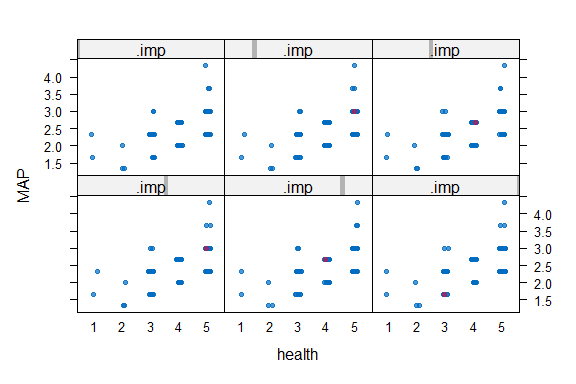
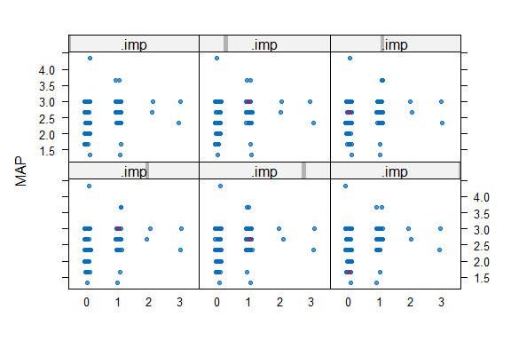

Business Intelligence Lab Submission Markdown
================
<Specify your group name here>
<Specify the date when you submitted the lab>

- [Student Details](#student-details)
- [Setup Chunk](#setup-chunk)
- [Load dataset](#load-dataset)
  - [Select features](#select-features)
- [Create new variable](#create-new-variable)
  - [Strip plot visualization](#strip-plot-visualization)
  - [Create impute data and carry out
    confirmations](#create-impute-data-and-carry-out-confirmations)

# Student Details

|                                                                                                                                                                                                                                   |                                                              |     |
|-----------------------------------------------------------------------------------------------------------------------------------------------------------------------------------------------------------------------------------|--------------------------------------------------------------|-----|
| **Student ID Numbers and Names of Group Members** \| \| \| 1. 134780 - C - Trevor Okinda \| \| \| \| 2. 132840 - C - Sheila Wangui \| \| \| \| 3. 131749 - C - Teresia Nungari \| \| \| 4. 135203 - C - Tom Arnold \| \| \| \| \| |                                                              |     |
| **GitHub Classroom Group Name**                                                                                                                                                                                                   | Lakers                                                       |     |
| **Course Code**                                                                                                                                                                                                                   | BBT4206                                                      |     |
| **Course Name**                                                                                                                                                                                                                   | Business Intelligence II                                     |     |
| **Program**                                                                                                                                                                                                                       | Bachelor of Business Information Technology                  |     |
| **Semester Duration**                                                                                                                                                                                                             | 21<sup>st</sup> August 2023 to 28<sup>th</sup> November 2023 |     |

# Setup Chunk

We start by installing all the required packages

``` r
## formatR - Required to format R code in the markdown ----
if (!is.element("formatR", installed.packages()[, 1])) {
  install.packages("formatR", dependencies = TRUE,
                   repos="https://cloud.r-project.org")
}
require("formatR")


## readr - Load datasets from CSV files ----
if (!is.element("readr", installed.packages()[, 1])) {
  install.packages("readr", dependencies = TRUE,
                   repos="https://cloud.r-project.org")
}
require("readr")

if (!is.element("dplyr", installed.packages()[, 1])) {
  install.packages("dplyr", dependencies = TRUE,
                   repos = "https://cloud.r-project.org")
}
require("dplyr")
require("naniar")

## ggplot2 ----
# We require the "ggplot2" package to create more appealing visualizations
if (!is.element("ggplot2", installed.packages()[, 1])) {
  install.packages("ggplot2", dependencies = TRUE,
                   repos = "https://cloud.r-project.org")
}
require("ggplot2")

## MICE ----
# We use the MICE package to perform data imputation
if (!is.element("mice", installed.packages()[, 1])) {
  install.packages("mice", dependencies = TRUE,
                   repos = "https://cloud.r-project.org")
}
require("mice")

## Amelia ----
if (!is.element("Amelia", installed.packages()[, 1])) {
  install.packages("Amelia", dependencies = TRUE,
                   repos = "https://cloud.r-project.org")
}
require("Amelia")
```

------------------------------------------------------------------------

**Note:** the following “*KnitR*” options have been set as the defaults
in this markdown:  
`knitr::opts_chunk$set(echo = TRUE, warning = FALSE, eval = TRUE, collapse = FALSE, tidy.opts = list(width.cutoff = 80), tidy = TRUE)`.

More KnitR options are documented here
<https://bookdown.org/yihui/rmarkdown-cookbook/chunk-options.html> and
here <https://yihui.org/knitr/options/>.

``` r
knitr::opts_chunk$set(
    eval = TRUE,
    echo = TRUE,
    warning = FALSE,
    collapse = FALSE,
    tidy = TRUE
)
```

------------------------------------------------------------------------

**Note:** the following “*R Markdown*” options have been set as the
defaults in this markdown:

> output:  
>   
> github_document:  
> toc: yes  
> toc_depth: 4  
> fig_width: 6  
> fig_height: 4  
> df_print: default  
>   
> editor_options:  
> chunk_output_type: console

# Load dataset

Load the student performance dataset

``` r
library(readr)
library(dplyr)
student_performance_dataset <- readr::read_csv("StudentPerformanceDataset.csv", col_types = readr::cols(class_group = readr::col_factor(levels = c("A",
    "B", "C")), gender = readr::col_factor(levels = c("1", "0")), YOB = readr::col_date(format = "%Y"),
    regret_choosing_bi = readr::col_factor(levels = c("1", "0")), drop_bi_now = readr::col_factor(levels = c("1",
        "0")), motivator = readr::col_factor(levels = c("1", "0")), read_content_before_lecture = readr::col_factor(levels = c("1",
        "2", "3", "4", "5")), anticipate_test_questions = readr::col_factor(levels = c("1",
        "2", "3", "4", "5")), answer_rhetorical_questions = readr::col_factor(levels = c("1",
        "2", "3", "4", "5")), find_terms_I_do_not_know = readr::col_factor(levels = c("1",
        "2", "3", "4", "5")), copy_new_terms_in_reading_notebook = readr::col_factor(levels = c("1",
        "2", "3", "4", "5")), take_quizzes_and_use_results = readr::col_factor(levels = c("1",
        "2", "3", "4", "5")), reorganise_course_outline = readr::col_factor(levels = c("1",
        "2", "3", "4", "5")), write_down_important_points = readr::col_factor(levels = c("1",
        "2", "3", "4", "5")), space_out_revision = readr::col_factor(levels = c("1",
        "2", "3", "4", "5")), studying_in_study_group = readr::col_factor(levels = c("1",
        "2", "3", "4", "5")), schedule_appointments = readr::col_factor(levels = c("1",
        "2", "3", "4", "5")), goal_oriented = readr::col_factor(levels = c("1", "0")),
    spaced_repetition = readr::col_factor(levels = c("1", "2", "3", "4")), testing_and_active_recall = readr::col_factor(levels = c("1",
        "2", "3", "4")), interleaving = readr::col_factor(levels = c("1", "2", "3",
        "4")), categorizing = readr::col_factor(levels = c("1", "2", "3", "4")),
    retrospective_timetable = readr::col_factor(levels = c("1", "2", "3", "4")),
    cornell_notes = readr::col_factor(levels = c("1", "2", "3", "4")), sq3r = readr::col_factor(levels = c("1",
        "2", "3", "4")), commute = readr::col_factor(levels = c("1", "2", "3", "4")),
    study_time = readr::col_factor(levels = c("1", "2", "3", "4")), repeats_since_Y1 = readr::col_integer(),
    paid_tuition = readr::col_factor(levels = c("0", "1")), free_tuition = readr::col_factor(levels = c("0",
        "1")), extra_curricular = readr::col_factor(levels = c("0", "1")), sports_extra_curricular = readr::col_factor(levels = c("0",
        "1")), exercise_per_week = readr::col_factor(levels = c("0", "1", "2", "3")),
    meditate = readr::col_factor(levels = c("0", "1", "2", "3")), pray = readr::col_factor(levels = c("0",
        "1", "2", "3")), internet = readr::col_factor(levels = c("0", "1")), laptop = readr::col_factor(levels = c("0",
        "1")), family_relationships = readr::col_factor(levels = c("1", "2", "3",
        "4", "5")), friendships = readr::col_factor(levels = c("1", "2", "3", "4",
        "5")), romantic_relationships = readr::col_factor(levels = c("0", "1", "2",
        "3", "4")), spiritual_wellnes = readr::col_factor(levels = c("1", "2", "3",
        "4", "5")), financial_wellness = readr::col_factor(levels = c("1", "2", "3",
        "4", "5")), health = readr::col_factor(levels = c("1", "2", "3", "4", "5")),
    day_out = readr::col_factor(levels = c("0", "1", "2", "3")), night_out = readr::col_factor(levels = c("0",
        "1", "2", "3")), alcohol_or_narcotics = readr::col_factor(levels = c("0",
        "1", "2", "3")), mentor = readr::col_factor(levels = c("0", "1")), mentor_meetings = readr::col_factor(levels = c("0",
        "1", "2", "3")), `Attendance Waiver Granted: 1 = Yes, 0 = No` = readr::col_factor(levels = c("0",
        "1")), GRADE = readr::col_factor(levels = c("A", "B", "C", "D", "E"))), locale = readr::locale())
```

## Select features

select 10 features and select 100 random variables

``` r
StudentPerformanceDataset_long <- student_performance_dataset %>%
    select(regret_choosing_bi, drop_bi_now, financial_wellness, health, day_out,
        night_out, alcohol_or_narcotics, romantic_relationships, spiritual_wellnes,
        friendships)
rand_ind <- sample(seq_len(nrow(StudentPerformanceDataset_long)), 100)
student_performance_dataset <- StudentPerformanceDataset_long[rand_ind, ]
```

Next, we confirm missingness

``` r
# Are there missing values in the dataset?
any_na(student_performance_dataset)
```

    ## [1] TRUE

``` r
# How many?
n_miss(student_performance_dataset)
```

    ## [1] 8

``` r
# What is the percentage of missing data in the entire dataset?
prop_miss(student_performance_dataset)
```

    ## [1] 0.008

``` r
# How many missing values does each variable have?
student_performance_dataset %>%
    is.na() %>%
    colSums()
```

    ##     regret_choosing_bi            drop_bi_now     financial_wellness 
    ##                      0                      0                      1 
    ##                 health                day_out              night_out 
    ##                      1                      1                      1 
    ##   alcohol_or_narcotics romantic_relationships      spiritual_wellnes 
    ##                      1                      1                      1 
    ##            friendships 
    ##                      1

``` r
# What is the number and percentage of missing values grouped by each variable?
miss_var_summary(student_performance_dataset)
```

    ## # A tibble: 10 × 3
    ##    variable               n_miss pct_miss
    ##    <chr>                   <int>    <dbl>
    ##  1 financial_wellness          1        1
    ##  2 health                      1        1
    ##  3 day_out                     1        1
    ##  4 night_out                   1        1
    ##  5 alcohol_or_narcotics        1        1
    ##  6 romantic_relationships      1        1
    ##  7 spiritual_wellnes           1        1
    ##  8 friendships                 1        1
    ##  9 regret_choosing_bi          0        0
    ## 10 drop_bi_now                 0        0

``` r
# What is the number and percentage of missing values grouped by each
# observation?
miss_case_summary(student_performance_dataset)
```

    ## # A tibble: 100 × 3
    ##     case n_miss pct_miss
    ##    <int>  <int>    <dbl>
    ##  1    42      8       80
    ##  2     1      0        0
    ##  3     2      0        0
    ##  4     3      0        0
    ##  5     4      0        0
    ##  6     5      0        0
    ##  7     6      0        0
    ##  8     7      0        0
    ##  9     8      0        0
    ## 10     9      0        0
    ## # ℹ 90 more rows

``` r
# Which variables contain the most missing values?
gg_miss_var(student_performance_dataset)
```

<!-- -->

``` r
# Where are missing values located (the shaded regions in the plot)?
vis_miss(student_performance_dataset) + theme(axis.text.x = element_text(angle = 80))
```

<!-- -->

``` r
# Which combinations of variables are missing together?
gg_miss_upset(student_performance_dataset)
```

<!-- -->

# Create new variable

We created a new variable MAP

``` r
# New variable MAP
student_performance_dataset <- student_performance_dataset %>%
    mutate(day_out = as.numeric(day_out), health = as.numeric(health), MAP = day_out +
        (1/3) * (health - day_out))

somewhat_correlated_variables <- quickpred(student_performance_dataset, mincor = 0.4)

student_performance_dataset_mice <- mice(student_performance_dataset, m = 5, method = "pmm",
    seed = 4, predictorMatrix = somewhat_correlated_variables)
```

    ## 
    ##  iter imp variable
    ##   1   1  financial_wellness  health  day_out  night_out  alcohol_or_narcotics  romantic_relationships  spiritual_wellnes  friendships  MAP
    ##   1   2  financial_wellness  health  day_out  night_out  alcohol_or_narcotics  romantic_relationships  spiritual_wellnes  friendships  MAP
    ##   1   3  financial_wellness  health  day_out  night_out  alcohol_or_narcotics  romantic_relationships  spiritual_wellnes  friendships  MAP
    ##   1   4  financial_wellness  health  day_out  night_out  alcohol_or_narcotics  romantic_relationships  spiritual_wellnes  friendships  MAP
    ##   1   5  financial_wellness  health  day_out  night_out  alcohol_or_narcotics  romantic_relationships  spiritual_wellnes  friendships  MAP
    ##   2   1  financial_wellness  health  day_out  night_out  alcohol_or_narcotics  romantic_relationships  spiritual_wellnes  friendships  MAP
    ##   2   2  financial_wellness  health  day_out  night_out  alcohol_or_narcotics  romantic_relationships  spiritual_wellnes  friendships  MAP
    ##   2   3  financial_wellness  health  day_out  night_out  alcohol_or_narcotics  romantic_relationships  spiritual_wellnes  friendships  MAP
    ##   2   4  financial_wellness  health  day_out  night_out  alcohol_or_narcotics  romantic_relationships  spiritual_wellnes  friendships  MAP
    ##   2   5  financial_wellness  health  day_out  night_out  alcohol_or_narcotics  romantic_relationships  spiritual_wellnes  friendships  MAP
    ##   3   1  financial_wellness  health  day_out  night_out  alcohol_or_narcotics  romantic_relationships  spiritual_wellnes  friendships  MAP
    ##   3   2  financial_wellness  health  day_out  night_out  alcohol_or_narcotics  romantic_relationships  spiritual_wellnes  friendships  MAP
    ##   3   3  financial_wellness  health  day_out  night_out  alcohol_or_narcotics  romantic_relationships  spiritual_wellnes  friendships  MAP
    ##   3   4  financial_wellness  health  day_out  night_out  alcohol_or_narcotics  romantic_relationships  spiritual_wellnes  friendships  MAP
    ##   3   5  financial_wellness  health  day_out  night_out  alcohol_or_narcotics  romantic_relationships  spiritual_wellnes  friendships  MAP
    ##   4   1  financial_wellness  health  day_out  night_out  alcohol_or_narcotics  romantic_relationships  spiritual_wellnes  friendships  MAP
    ##   4   2  financial_wellness  health  day_out  night_out  alcohol_or_narcotics  romantic_relationships  spiritual_wellnes  friendships  MAP
    ##   4   3  financial_wellness  health  day_out  night_out  alcohol_or_narcotics  romantic_relationships  spiritual_wellnes  friendships  MAP
    ##   4   4  financial_wellness  health  day_out  night_out  alcohol_or_narcotics  romantic_relationships  spiritual_wellnes  friendships  MAP
    ##   4   5  financial_wellness  health  day_out  night_out  alcohol_or_narcotics  romantic_relationships  spiritual_wellnes  friendships  MAP
    ##   5   1  financial_wellness  health  day_out  night_out  alcohol_or_narcotics  romantic_relationships  spiritual_wellnes  friendships  MAP
    ##   5   2  financial_wellness  health  day_out  night_out  alcohol_or_narcotics  romantic_relationships  spiritual_wellnes  friendships  MAP
    ##   5   3  financial_wellness  health  day_out  night_out  alcohol_or_narcotics  romantic_relationships  spiritual_wellnes  friendships  MAP
    ##   5   4  financial_wellness  health  day_out  night_out  alcohol_or_narcotics  romantic_relationships  spiritual_wellnes  friendships  MAP
    ##   5   5  financial_wellness  health  day_out  night_out  alcohol_or_narcotics  romantic_relationships  spiritual_wellnes  friendships  MAP

## Strip plot visualization

``` r
# strip plot visualiziation
stripplot(student_performance_dataset_mice, MAP ~ health | .imp, pch = 20, cex = 1)
```

<!-- -->

``` r
stripplot(student_performance_dataset_mice, MAP ~ night_out | .imp, pch = 20, cex = 1)
```

<!-- -->

## Create impute data and carry out confirmations

``` r
# create imputed data
student_performance_dataset_imputed <- mice::complete(student_performance_dataset_mice,
    1)

# confirmation
miss_var_summary(student_performance_dataset_imputed)
```

    ## # A tibble: 11 × 3
    ##    variable               n_miss pct_miss
    ##    <chr>                   <int>    <dbl>
    ##  1 regret_choosing_bi          0        0
    ##  2 drop_bi_now                 0        0
    ##  3 financial_wellness          0        0
    ##  4 health                      0        0
    ##  5 day_out                     0        0
    ##  6 night_out                   0        0
    ##  7 alcohol_or_narcotics        0        0
    ##  8 romantic_relationships      0        0
    ##  9 spiritual_wellnes           0        0
    ## 10 friendships                 0        0
    ## 11 MAP                         0        0

``` r
# visual confirmation
Amelia::missmap(student_performance_dataset_imputed)
```

<!-- -->

``` r
# Are there missing values in the dataset?
any_na(student_performance_dataset_imputed)
```

    ## [1] FALSE

``` r
# How many?

n_miss(student_performance_dataset_imputed)
```

    ## [1] 0

``` r
# What is the percentage of missing data in the entire dataset?
prop_miss(student_performance_dataset_imputed)
```

    ## [1] 0

``` r
# How many missing values does each variable have?
student_performance_dataset_imputed %>%
    is.na() %>%
    colSums()
```

    ##     regret_choosing_bi            drop_bi_now     financial_wellness 
    ##                      0                      0                      0 
    ##                 health                day_out              night_out 
    ##                      0                      0                      0 
    ##   alcohol_or_narcotics romantic_relationships      spiritual_wellnes 
    ##                      0                      0                      0 
    ##            friendships                    MAP 
    ##                      0                      0

``` r
# What is the number and percentage of missing values grouped by each variable?
miss_var_summary(student_performance_dataset_imputed)
```

    ## # A tibble: 11 × 3
    ##    variable               n_miss pct_miss
    ##    <chr>                   <int>    <dbl>
    ##  1 regret_choosing_bi          0        0
    ##  2 drop_bi_now                 0        0
    ##  3 financial_wellness          0        0
    ##  4 health                      0        0
    ##  5 day_out                     0        0
    ##  6 night_out                   0        0
    ##  7 alcohol_or_narcotics        0        0
    ##  8 romantic_relationships      0        0
    ##  9 spiritual_wellnes           0        0
    ## 10 friendships                 0        0
    ## 11 MAP                         0        0

``` r
# What is the number and percentage of missing values grouped by each
# observation?
miss_case_summary(student_performance_dataset_imputed)
```

    ## # A tibble: 100 × 3
    ##     case n_miss pct_miss
    ##    <int>  <int>    <dbl>
    ##  1     1      0        0
    ##  2     2      0        0
    ##  3     3      0        0
    ##  4     4      0        0
    ##  5     5      0        0
    ##  6     6      0        0
    ##  7     7      0        0
    ##  8     8      0        0
    ##  9     9      0        0
    ## 10    10      0        0
    ## # ℹ 90 more rows

``` r
# Which variables contain the most missing values?
gg_miss_var(student_performance_dataset_imputed)
```

<!-- -->

``` r
# We require the 'ggplot2' package to create more appealing visualizations

# Where are missing values located (the shaded regions in the plot)?
vis_miss(student_performance_dataset_imputed) + theme(axis.text.x = element_text(angle = 80))
```

<!-- -->

**etc.** as per the lab submission requirements. Be neat and communicate
in a clear and logical manner.
